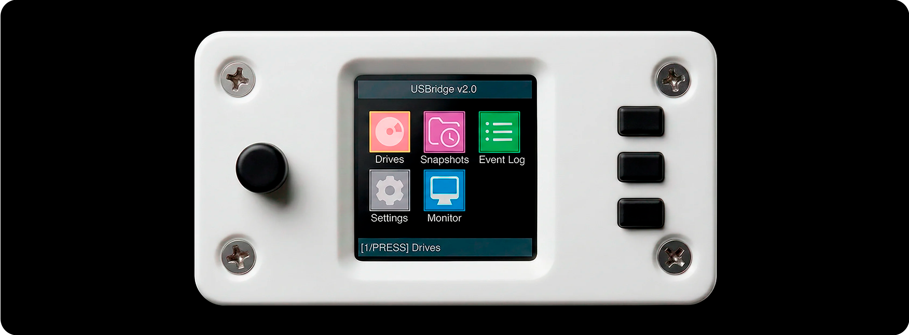

  

### Professional BIOS-level KVM over IP for bare-metal infrastructure.

USBridge is a hardware-based management solution designed for mission-critical server environments. It provides reliable out-of-band connectivity and secure remote access to your hardware without relying on cloud-dependent engines.

---

### Key Technical Features
* **BIOS-in-Terminal:** Deterministic text-mode conversion for legacy and modern UEFI environments.
* **Storage Emulation:** High-speed USB Mass Storage mounting for OS deployment (No PXE setup required).
* **Data Integrity:** Hardware-isolated Btrfs snapshots with a dedicated data protection layer.

---

### Hardware in Action

*USBridge v2.0 hardware interface with integrated OSD and tactile controls.*

---

### Hardware Specifications
| Component | Details |
| :--- | :--- |
| **SoC** | Rockchip RK3566 (Quad-Core ARM Cortex-A55) |
| **RAM** | 2GB / 4GB LPDDR4X options |
| **Storage** | 16GB eMMC 5.1 + MicroSD Slot |
| **Video In** | HDMI Input (Full HD support) |
| **USB** | USB-C OTG (Mass Storage Emulation) |
| **Networking** | 10/100/1000 Mbps Ethernet |
| **Interface** | Integrated LCD Status Display + Rotary Encoder |

---

### Project Resources

 

 

---

*Control. Protect. Recover.*
